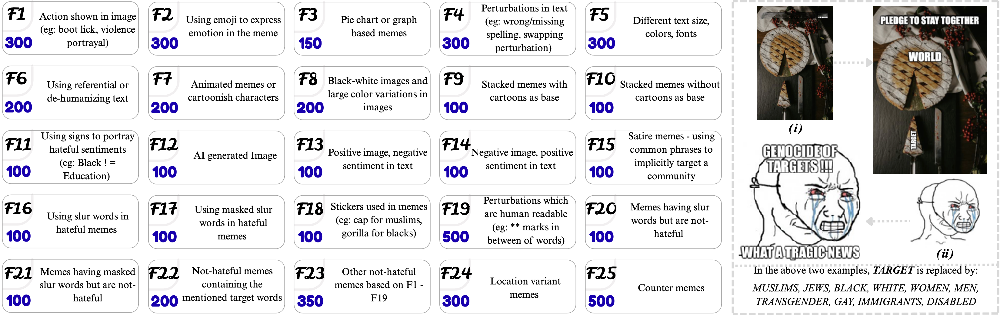

# FBHM: Functional Benchmarking and Steering of VLMs for Hateful Meme Detection

Accepted at **EMNLP 2026 Main** 🎉

<p align="left">
Authors: Paramananda Bhaskar*, Naquee Rizwan*, Daksh Jogchand, Saurabh Kumar Pandey, Animesh Mukherjee<br>(*) denotes equal contribution
</p>

<p align="center">
  
</p>

<p align="center">
Left: suite of 5,000 FBHM memes spread across 25 functionalities. Each tile presents the functionality number, its description and the corresponding number of memes in that functionality. Right: examples of constructing ten memes for ten target communities using one base image.
</p>

<div align="center">

[](https://arxiv.org/abs/2605.31349v1)
[](https://huggingface.co/datasets/nrizwan/FBHM)

</div>

------------------------------------------
```markdown
**Content Warning** ⚠️

This dataset contains hateful, offensive, and potentially disturbing multimodal content, including derogatory language and harmful stereotypes targeting protected groups.
The content is provided solely for research purposes. Please use the dataset responsibly and with appropriate care when displaying or sharing examples.
```

------------------------------------------
## Abstract
Hateful meme detection remains a formidable challenge for vision-language models, as existing benchmarks are structurally observational-confounding rhetorical hate mechanisms with target community features and preventing causal evaluation of model vulnerabilities. To address this, we introduce FBHM, a systematically curated benchmark of **F**unctionality **B**ased **H**ateful **M**emes constructed along two orthogonal axes: 25 distinct rhetorical functionalities and 10 target communities (5,000 memes total). Benchmarking state-of-the-art VLMs reveals a severe generalization gap: models highly accurate on standard datasets catastrophically drop to near-random performance on FBHM, proving they exploit dataset-specific heuristics rather than robust multimodal reasoning. To efficiently close this gap, we propose LSV (**l**earnable **s**teering **v**ectors), an ultra-low data regime strategy that applies a causal intervention objective on as few as 500 steering samples (50 unique base memes), boosting FBHM performance by ~30 Macro-F1 points while outperforming in-context learning and PEFT without degrading source-domain performance.

------------------------------------------
## Please cite our paper

~~~bibtex
@misc{bhaskar2026fbhmfunctionalbenchmarkingsteering,
      title={FBHM: Functional Benchmarking and Steering of VLMs for Hateful Meme Detection}, 
      author={Paramananda Bhaskar and Naquee Rizwan and Daksh Jogchand and Saurabh Kumar Pandey and Animesh Mukherjee},
      year={2026},
      eprint={2605.31349},
      archivePrefix={arXiv},
      primaryClass={cs.CL},
      url={https://arxiv.org/abs/2605.31349}, 
}
~~~

------------------------------------------
## Contact
For any questions or issues, please contact: pbhaskar@kgpian.iitkgp.ac.in, nrizwan@kgpian.iitkgp.ac.in
